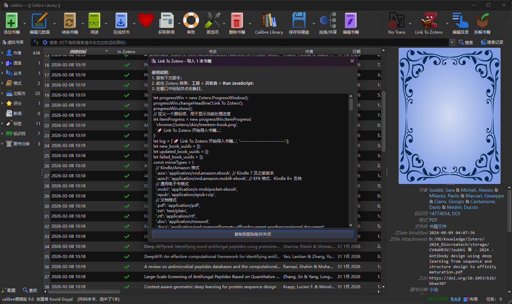

# Link To Zotero

https://img.shields.io/badge/License-MIT-green.svg
https://img.shields.io/badge/Zotero-8.0.x-blue
https://img.shields.io/badge/Calibre-9.0.x-orange

Import PDF books from Calibre to Zotero as linked files with most metadata preserved.

> Inspired by [ZMI]([Calibre "Zotero Metadata Importer" Plug-in - Zotero Forums](https://forums.zotero.org/discussion/60898/calibre-zotero-metadata-importer-plug-in))

## ✨ Features

- **📤 One-Click Import** - Generate JavaScript scripts to import PDFs from Calibre to Zotero
- **🔄 Sync Status Tracking** - Generate scripts to check import status and sync progress
- **📚 Metadata Preservation** - Maintains book metadata (title, author, tags, etc.) during transfer
- **⚡ Batch Processing** - Import multiple PDFs at once with automatic metadata mapping

## 🚀 How It Works

This plugin creates JavaScript bridge scripts that:

1.  Extract metadata from Calibre books
2.  Generate compatible import scripts for Zotero
3.  Track which books have been successfully imported
4.  Provide sync status verification
